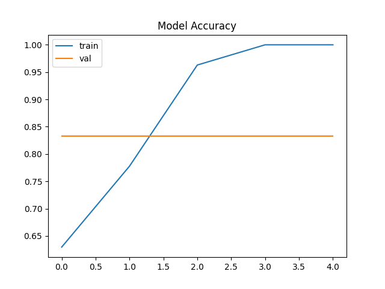

# Face Mask Detection using CNN 😷

This project detects whether a person is wearing a face mask or not using a Convolutional Neural Network (CNN).

---

## 📌 Problem Statement
Automatically identify whether a person in an image is wearing a face mask.  
This is a binary classification problem with two classes:
- With Mask
- Without Mask

---

## 🧠 Approach
- Used a CNN-based model for image classification
- Applied transfer learning using a pre-trained CNN
- Trained the model on a labeled image dataset
- Evaluated performance using accuracy and visual predictions

---
## 📦 Dataset
This project uses a Face Mask Detection dataset from Kaggle.

Due to size limitations, a small subset of images is uploaded here.
Full dataset can be found below 
https://www.kaggle.com/datasets/omkargurav/face-mask-dataset


## 🛠️ Tech Stack
- Python
- TensorFlow / Keras
- OpenCV
- NumPy
- Matplotlib

---

## 📊 Results
The model achieves good classification performance on the validation set and correctly identifies mask usage in sample images.

<p align="center">
  
</p>

---

## ▶️ How to Run
```bash
pip install -r requirements.txt
python src/train.py
